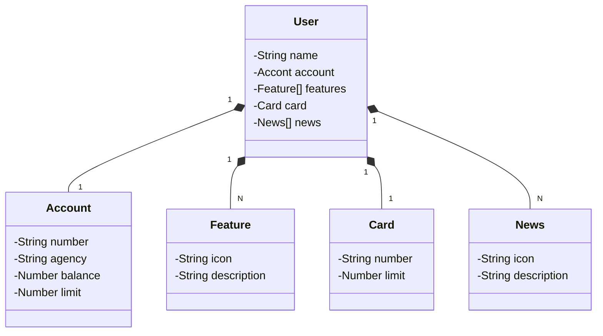

# Publicando API REST na Nuvem Usando Spring Boot 3, Java 17 e Railway

## Tecnologias:
*Java 17*: Foi utilizado a versão 17 LTS do Java.
*Spring Boot 3*: Foi utilizado a versão mais nova do Spring Boot, que maximiza a produtividade do desenvolvedor por meio de sua poderosa premissa de autoconfiguração.
*Spring Data JPA*: Foi utilizado para simplificar a camada de acesso aos dados, facilitando a integração com bancos de dados SQL.
*OpenAPI (Swagger)*: Foi criada a documentação de API eficaz  e fácil de entender usando o OpenAPI totalmente alinhada com a produtividade  que o Spring Boot oferece.
*Railway*: facilita o deploy e monitoramento de nossas soluções na nuvem, além de oferecer diversos bancos de dados como serviços e pipelines de CI/CD.

## Diagrama de Classes (Domínio da API) 
    Os aplicativos que apresentam as informações, precisam consumir dados da API, portanto se faz necessário separar quais dados iniciais estaram presentes na interface e analiza-los/entende-los, para que o contrato da API seja efetivo e consigamos adicionar essas informações na tela.
    1) Foi criado uma abstração do domínio no figma, coletado as informações que aparecem e com essas informações um  json que representa essas dados e possíveis features. 
	    - Editor Json/ validar : https://jsoneditoronline.org/
        - estruturando o json pensando nas endidades:
        ```json
            {
                "name": "Samuel",
                "account": {
                    "number": "00000000-0",
                    "agency": "0000",
                    "balance": 1323.55,
                    "limit": 1000.00
                },
                "feature": [
                    {
                        "icon": "URL",
                        "description": "Descrição da feature"
                    }
                ],
                "card": {
                    "number": "xxxx xxxx xxxx 0000",
                    "limit": 1000.00
                },
                "news": [
                    {
                        "icon": "URL",
                        "description": "Descrição da novidade"
                    }
                ]

            }

        ```

 - Transformando o JSON em uma forma visual em classes java, tornando um diagrama de classes feito na sintaxe mermaid (mermaid.js.org):


    2) Após a criação das classes do Model, será necessário os devidos mapeamentos das entidades para o banco. 
    3) A criação da camada Repository (JPA Repository) que é uma interface do Usuário, o que vai prover operações básicas de manipulação.
    4) Não será utilizado o application.properties, toda a área de resources será substituido pelo padrão .yml - que é mais flexivel, e terá um perfil de dev, com as configurações (datasource, jpa, h2).
    5) Implementação da camada Service com a criação da interface UserService e classe UserServiceImplementation com o objetivo de encapsular a interface, não expor além do necessário. 
    6) Exposição da API REST através da camada Controller (expor os endpoints criados anteriormente na camada de serviço, de crear e buscar por Id). Criação do UserController.


    
